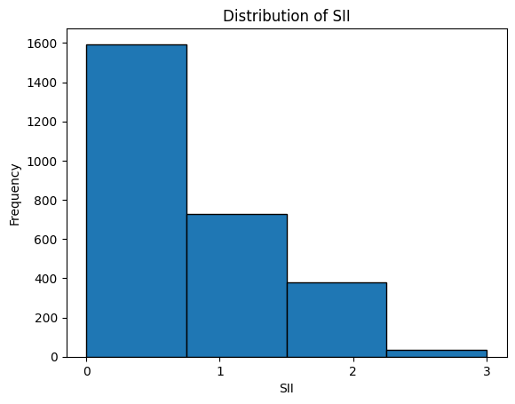
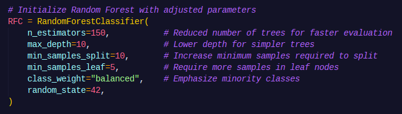
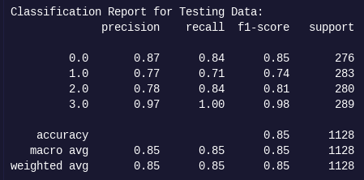
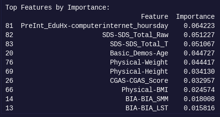
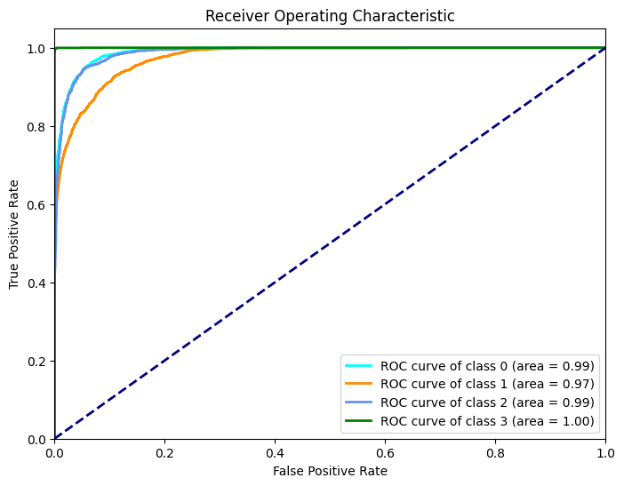
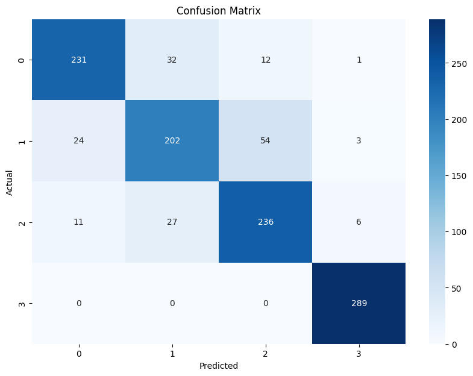

# Kaggle Competition: Child Mind Institute — Problematic Internet Use

## Overview

This repository contains the code and documentation for our participation in [Child Mind Institute — Problematic Internet Use](https://www.kaggle.com/competitions/child-mind-institute-problematic-internet-use):

> <i>"The goal of this competition is to develop a predictive model that analyzes children's physical activity and fitness data to identify early signs of problematic internet use. Identifying these patterns can help trigger interventions to encourage healthier digital habits."</i> - Kaggle

## Introduction

This project aims to develop a predictive model to identify problematic internet use among children and adolescents by analyzing their physical activity and fitness data. The dataset includes various metrics related to physical activity, fitness levels, and internet use scores. By leveraging these indicators, we hope to identify early signs of unhealthy internet habits, enabling timely interventions to promote healthier digital behaviors and support children's mental health.

## Data Loading

The data is loaded from CSV and Parquet files, which include training and testing datasets. The project processes these files to extract relevant features and prepare the data for analysis.

## Data Visualization

Data visualization techniques are employed to understand the distribution of the target variable (Severity Impairment Index, SII) and to identify missing values in the dataset. Visualizations help in assessing the overall data quality and understanding the relationships between different features.

## Data Preprocessing

The preprocessing steps include dropping unnecessary columns, applying one-hot encoding to categorical variables, and aligning the training and testing datasets. Missing values are handled appropriately to ensure the integrity of the data before model training.

## Model Development

Two models are developed in this project: a Random Forest model and a Logistic Regression model. The Random Forest model is used to predict the SII based on the processed data, and it is evaluated for accuracy and performance. The Logistic Regression model is implemented for comparison, allowing for an assessment of different modeling approaches.

## Results

The performance of both models is evaluated using metrics such as accuracy, classification reports, and confusion matrices. The results provide insights into the effectiveness of the models in predicting problematic internet use.

## Conclusion

This project demonstrates the potential of using physical activity and fitness data as proxies for predicting problematic internet use among children and adolescents. The findings can inform interventions aimed at promoting healthier digital habits and supporting mental health in young individuals.

### Final Kaggle Competition Results

## Contributors

- Anusha Ghimire: 
- Célie Pierre: 

## Citation

Adam Santorelli, Arianna Zuanazzi, Michael Leyden, Logan Lawler, Maggie Devkin, Yuki Kotani, and Gregory Kiar. Child Mind Institute — Problematic Internet Use. https://kaggle.com/competitions/child-mind-institute-problematic-internet-use, 2024. Kaggle.

## Figures

*Figure 1: Distribution of SII*

*Figure 2: Classification report*

*Figure 3: Random Forest with adjusted parameters*

*Figure 4: Feature importance*

*Figure 5: ROC curve*

*Figure 6: Confusion matrix*
